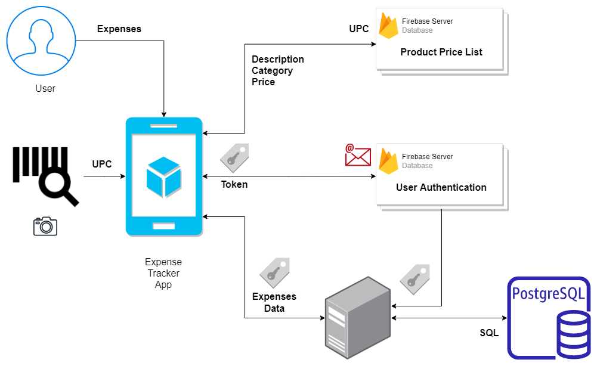
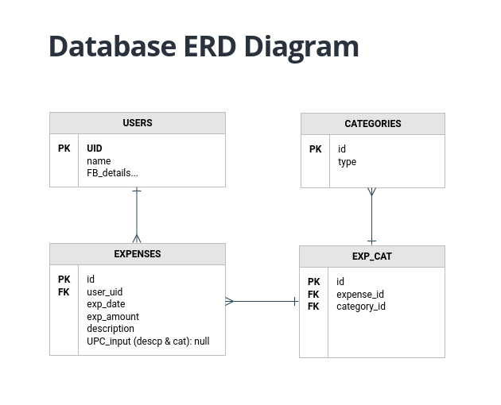
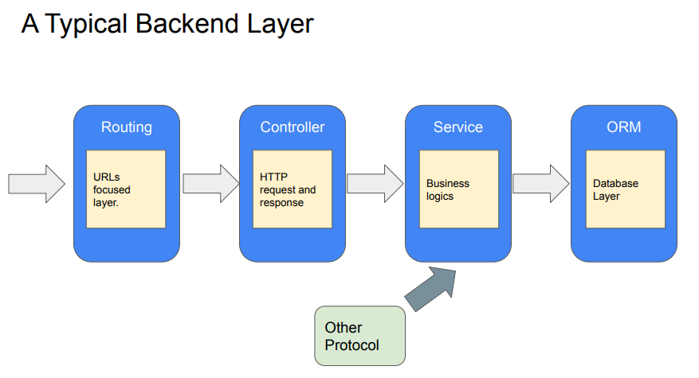

# Group 1 Capstone Project - Expense Tracker App

Full-Stack Expense Tracker App using MVC Architecture.

Front-End: React-Native, React | Back-End: Node.js, PostgreSQL, Sequelize

## Usecase Overview


## Component Hierarchy 


## ERD for Expenses Database




[Live link of component diagram](https://drive.google.com/file/d/18gFM3l5t8SxogWHo97P6_805FVpia1CI/view?usp=sharing)

## Main Packages
### ExpensesApp 
- react (https://reactjs.org/)
- react-native (https://reactnative.dev/)
- react-navigation (https://reactnavigation.org/)
- expo (https://docs.expo.dev/)
- axios (https://axios-http.com/)

### Server
- firebase-admin (https://www.npmjs.com/package/firebase-admin)
- sequelize (https://sequelize.org/)


## BackEnd Technologies used:
- Model View Controller Architecture
- nodeJS
- Firebase authentication
- ExpressJS
  - Middleware: Firebase Authentication
  - Routing
- SequelizeJS
  - ORM
  - Queries

```javascript
Project structure:
- server/
  - index.js
  - middleware
    - index.js
  - config
    - firebase-config.js
    - serviceAccKey.json
  - routes
    - index.js
    - expenseRoutes.js
  - controllers
    - userController.js
    - expenseController.js
  - services
    - userService.js
    - expenseService.js
  - models
    - index.js
    - user.model.js
    - expense.model.js
    - expense_category.model.js
    - category.model.js
```
## Expense API End-points
```javascript
    router.route("/api/expense/get") 
    router.route("/api/expense/add") 
    router.route("/api/expense/:expenseId/edit") 
    router.route("/api/expense/:expenseId/delete") 
```

## API Deployment
- Heroku
- addon: Heroku Postgres


## Documentation
`useReducer` (https://beta.reactjs.org/apis/usereducer)

`useContext` (https://beta.reactjs.org/apis/usecontext)

`createContext` (https://beta.reactjs.org/apis/createcontext)