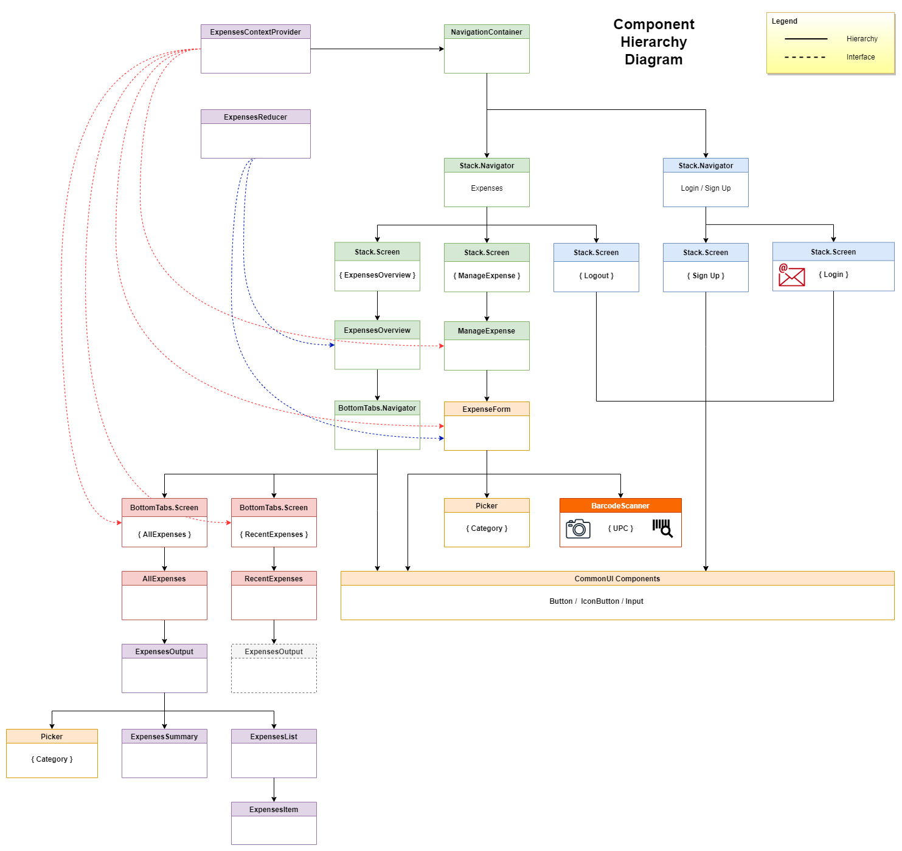

# Group 1 Capstone Project - Expense Tracker App

Full-Stack Expense Tracker App using MVC Architecture.

Front-End: React-Native, React | Back-End: Node.js, PostgreSQL, Sequelize

[Live link of component diagram](https://drive.google.com/file/d/18gFM3l5t8SxogWHo97P6_805FVpia1CI/view?usp=sharing)

## Documentation

`useReducer` (https://beta.reactjs.org/apis/usereducer)

`useContext` (https://beta.reactjs.org/apis/usecontext)

`createContext` (https://beta.reactjs.org/apis/createcontext)

